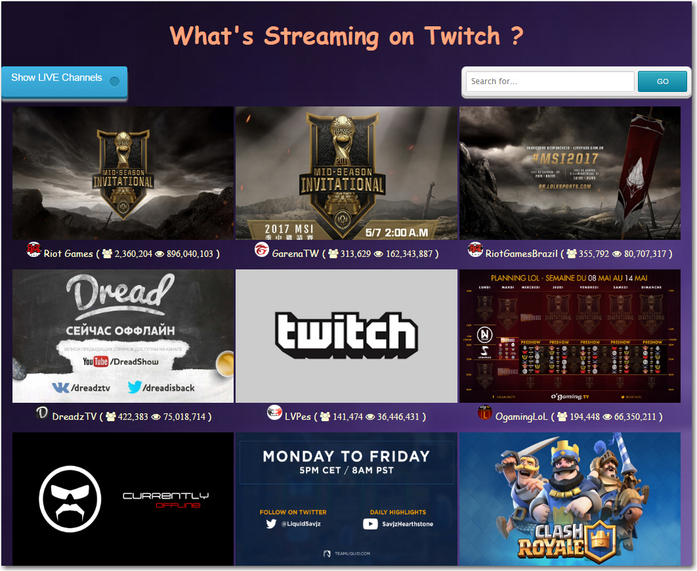

An exercise to gather information on channels on Twitch TV (endpoint
 https://api.twitch.tv/kraken/channels/).

Click blue button to show a list of live channels, hover over
to make image larger, also hover over the owner icon to magnify it.

This page was written as one of the projects in freecodecamp courses.

 

Here is the live link https://twitch-tv.herokuapp.com/
